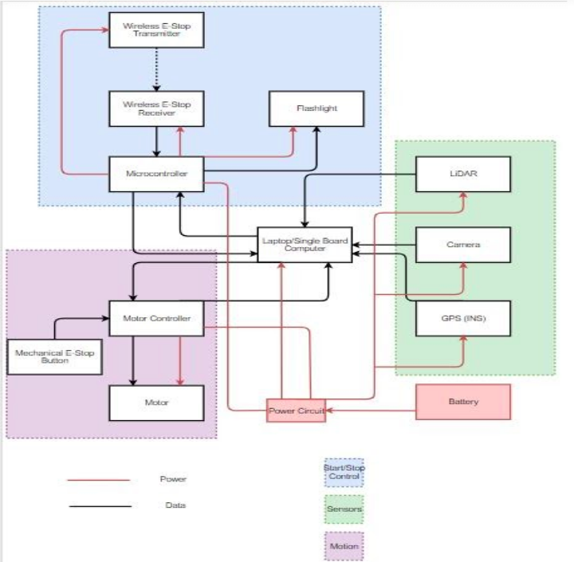

# BoilerBot

An autonomous vehicle designed and developed by ten senior design students at Purdue University to take part in the Intelligent Ground Vehicle Competition. The team, consisting of mechanical, electrical and computer engineers, started from scratch and developed a first virtual prototype within 3 months. Hopefully, this will be helpful to a Purdue team in the future that takes part in this competition.

### Demo
BoilerBot Demo: https://www.youtube.com/watch?v=RguvJBDiZ8Q

### Description
The vehicle control system was built using the Robot Operating System framework. Our team took full advantage of existing ROS libraries. The robot was tested in the Gazebo simulation environment and sensor readings were visualized on Rviz. The testing environment is very similar to the actual IGVC course. A lidar was used for obstacle detection and a camera was used for detecting obstacles, lanes and potholes. 

#### High-level Embedded System Diagram

#### Decisions
Some decisions I made made while working on this project were:
1. Use ROS. The Main reason for this was the fact that there are lots of resources and packages that we could take advantage of to build our autonomous vehicle. ROS also makes life relatively easy when it comes to experimenting with domain randomization with Gazebo for simulation and Rviz for visualization which can be utilized in the future.
1. Start with gmapping, which is a simultaneous localization and mapping algorithm. This was mainly due to two reasons. Firstly, because our team had only three months to come up with a prototype and therefore it was better to use already existing packages instead of writing our own. Second, it is important to start with some sort of a baseline so in the future, teams can compare their results to this baseline. Having such a baseline is imperative for any machine learning project.
1. Start with traditional computer vision algorithms to perform lane detection, again for the same reasons as stated above. 

#### Future Work
Future teams can work on improving the navigation system by experimenting with state of the art algorithms or building their own. The lane detection algorithm also has a lot of scope for improvement by applying deep learning based computer vision techniques by capturing and labeling data. Experimentation in the real world (maybe experimenting with and applying domain randomization techniques) is another area of future work.

### Usage

Clone integration branch inside `src/` directory in your catkin workspace.  
Run:  
`catkin_make`  
`source devel/setup.bash` 
`roslaunch boilerbot_gazebo_integ auto_nav.launch` 

This should launch the Gazebo simulation environment. 

Run: 
`roslaunch boilerbot_nav_integ gmapping_demo.launch`

This should launch the simultaneous localization and mapping and also an Rviz visualization software

Now you are ready to start experimenting! 

If you need to control the robot using teleop, run: `roslaunch boilerbot_nav_integ mybot_teleop.launch`
